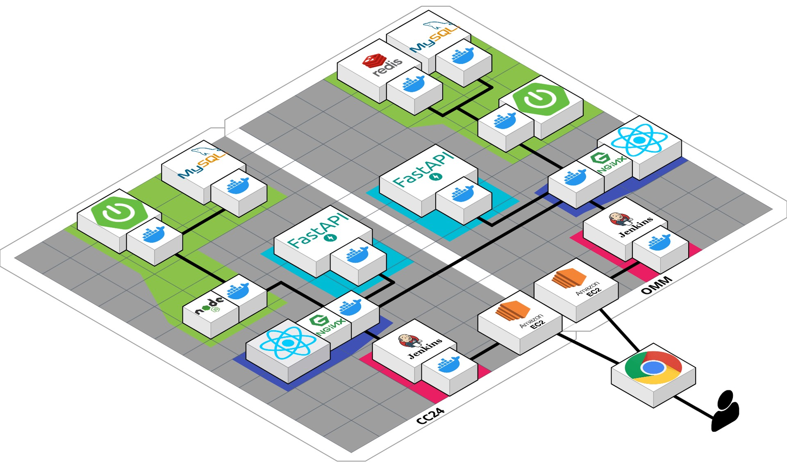

# README.md

# 🌱이공팔청춘

# OMM (Oh My Match!)

> 개발기간 : 2023.02 ~ 2023.04
> 
 

## 📢 배포 주소

> CC24 : [https://j8c208.p.ssafy.io](https://j8c208.p.ssafy.io/)  
OMM : [https://j8c2081.p.ssafy.io](https://j8c2081.p.ssafy.io)
> 
 

## 🤲팀원 소개
<table>
  <tbody>
    <tr>
      <td align="center"><a href=""> <b>FE 최보영</b></a> 얼굴 인식, UI/UX</td>
      <td align="center"><a href=""> <b>FE 원채령</b></a> DID, UCC</td>
      <td align="center"><a href=""> <b>FE 임양원</b></a> OCR, SockJS</td>
     <tr/>
      <td align="center"><a href=""> <b>BE 박성완 (팀장)</b></a> PM, 추천, DB</td>
      <td align="center"><a href=""> <b>BE 안수빈</b></a> DID, Infra</td>
      <td align="center"><a href=""> <b>BE 김윤미</b></a> Git, CI/CD, Socket</td>
    </tr>
  </tbody>
</table>

 

## 🐈사용 기술 

### ✔️Front-end  
  

### ✔️Back-end  
  
  
### ✔️Infra  
  
  

 

## 👉프로젝트 소개

### 서비스 개요

- 블록체인 기반 검증된 상대를 만날 수 있는 소개팅 웹 사이트

### 주요 기능

- DID를 활용한 회원가입 및 로그인
- 대학, 직장, 자격증 등 공인된 인증서 불러오기
- 매칭 상대 추천
- 매칭된 상대와 1대1 채팅
- 악성 유저 신고

### 프로젝트 특장점

1. OCR를 활용한 신분증 확인
    - 가상인증센터(CC24) 가입 시 신분증을 OCR로 읽어 신분증 내용 기반으로 신분증 VC 발급
2. 본인인증을 위한 얼굴인식 및 인증
    - 신분증 VC에 얼굴 정보 저장
    - 매칭 성사 전 얼굴 인증 진행
3. 블록체인 기반 DID로 회원 인증 정보 관리
    - 회원이 가상인증센터(CC24)에서 특정 인증서를 요청하면, 신분증 VC를 이용하여 VP를 생성하여 제출, VP 기반으로 VC 발급
4. 선호 정보에 따른 유저 추천 기능
    - 유클리드 거리 기반 알고리즘을 이용해 상대 추천
5. Spring Web Socket API와 Redis를 이용한 채팅, 알림 기능
    - 메세지와 알림을 실시간으로 수신 및 발신

 

## 🏞️개발 환경

### Frontend

| React | 18.0.28 |
| --- | --- |
| Node.js | 16.18.0 |
| VSCode | 1.74.2 |
| tailwind | 3.2.7 |
| npm | 8.19.2 |
| eslint | 8.36.0 |
| react-redux | 8.0.5 |
| vite | 4.2.0 |

### Backend

| Spring Boot | 2.7.9 |
| --- | --- |
| Java | 11 |
| IntelliJ | 2022.3.1 |
| Node.js | 18.15.0 |
| FastAPI | 0.95.0 |
| Python | 3.10.1 |
| MySQL | latest |
| Redis | latest |

 

## 📐아키텍처 설계

 

## 💻피그마 설계

 

 

## 💽ERD 설계

 

### OMM Database

 

 

### CC24 인증용 Database

 

 

# 📺주요 화면

 

## CC24

 

- 회원가입
    - OCR을 이용해 주민등록증에서 이름, 생년월일, 성별 정보로 회원 인증 후 회원 가입
    - FastAPI와 NodeJS에서 회원 정보 서명 및 검증 진행 후 신분증 VC 발급

 

 

- 비밀번호 설정
    - CC24 비밀번호 설정
    - 비밀번호 일치 시 인증서 사용 가능

 

 

- 신분증 VC 발급
    - 본인 확인 정보로 신분증 VC 발급
    - 인증서 카드를 클릭하여 내용 확인 가능
    
    
    
 

- 얼굴 인증
    - 얼굴 인증 시 VC에 저장된 얼굴 정보를 기반으로 얼굴 인증 진행
    - 업로드한 얼굴 정보를 VC에 저장

 

- 회원 가입 완료
    - 필요한 모든 정보를 입력하고 나면 회원가입 완료

- 학교, 직장 등 인증서 발급
    - 각 기관이 발행해준 인증서를 VC로 저장

 

## OMM

 

- 회원가입
    - CC24 가입할 때 설정한 비밀번호 입력
    - CC24에서 인증 후 가입

 

 

- 추가 정보 입력
    - 내 추가 정보, 선호하는 상대 정보 입력

 

 

- 본인 프로필 조회
    - 본인을 나타낼 수 있는 사진 여러 장 업로드 가능
    - CC24에서 불러온 인증서 조회 가능

 

 

- 인증서 인증
    - 프로필에 나타내고 싶은 인증서를 선택해서 인증 가능
    

 

- 추천된 상대에게 좋아요 / 싫어요 표시
    - 좋아요를 표시하면 상대에게 알림 표시

 

- 매칭 상대 추천
    - 유클리드 거리 기반 알고리즘을 사용하여 매칭 상대 추천
    - 좋아요로 채팅 신청 가능
    - 싫어요로 내 추천 목록에서 제거 가능

 

 

- 좋아요 알림
    - 프로필에서 좋아요 버튼 클릭 시 상대방에게 좋아요 알림 전달
    - 프로필 사진 클릭 시 상대방 정보 확인 가능

- 다른 사람 프로필 조회
    - 추천 목록에서 매칭 상대의 프로필을 클릭하여 프로필 조회 가능
    - 입력한 정보 및 인증 내용 조회 가능
    

 

 

- 채팅방 생성
    - 채팅 요청을 수락할 경우 VC에 저장된 얼굴 정보를 기반으로 본인 확인 진행
    - 인증이 성공한 후 채팅방 생성
    

 

 

- 채팅
    - 채팅 기능을 사용하여 매칭 상대와 채팅 가능

 

 

- 신고
    - 채팅 중 불미스러운 일이 발생할 경우 상대방 신고 가능
    

 

 

- 악성 유저일 시 신고

- 관리자 페이지
    - 관리자 계정으로 로그인 후 신고 내역 처리, 조회 가능
    
    - 관리자 계정으로 접속하여 신고 관리 가능
    - 관리자가 판단 후 조치 진행
    
    
 
 
   

---

 

# 프로젝트 소감

## 박성완

블록체인이라는 도메인은 생각보다 어렵고 복잡했다. 웹에서의 사용이 제한적이었고, 설계가 몇 번 바뀌기도 했다. 때문에 계획이 자주 미뤄지기도 했지만, 좋은 팀원들과 함께 무사히 끝마칠 수 있어서 다행이었다.

오랜만에 백엔드를 맡았는데, JPA 기술을 잘 활용할 수 있어서 좋았다. 간단했지만 추천 알고리즘을 구현해 본 것도 신기했고, 빠른 개발을 위해 FastAPI를 사용해 본 것도 매력적이었다.

개발 마지막 주에는 잦은 버그를 잡느라 고생이 많았지만, 나중에 더 꼼꼼한 설계를 해야겠다고 다짐하는 계기가 되었다.

## 안수빈

DID를 활용하여 사용자 인증 로직을 작성하면서 어떻게 하면 사용자를 인증할 수 있을까에 고민을 많이 하게 되었습니다. 가상의 신분증을 만들기 때문에 사용자가 입력을 위조할 수 있으면 안된다고 생각했고, 서명 및 검증 로직을 추가하게 되었습니다. DID를 구현하며 암호화/복호화에 대한 많은 공부를 할 수 있었고, 신원 인증을 위해서 보다 안전한 인증 방식을 생각할 수 있었습니다. 또한 스프링 시큐리티를 커스텀해서 자체 인증 로직을 구현해볼 수 있는 좋은 기회가 되었습니다. 

많은 서버를 띄우고 서버 끼리 통신이 잦았기 때문에 도커를 활용하여 간단하게 배포를 진행할 수 있도록 했습니다. 또한 배포 서버에서 테스트를 진행하며 API 연결이 잘 되었는지 확인하였습니다.

## 김윤미

블록체인이라는 기술을 처음 활용해볼 수 있는 좋은 기회였습니다.

DID 로직에 대해 이해하게 되었고 기술적 한계도 느꼈지만 DID 원칙을 준수하면서 기능을 개발하기 위해 수많은 고민을 해볼 수 있었고 우리 서비스의 DID를 구현할 수 있었어서 좋았습니다.

Spring WebSocket API와 Redis를 이용해 유저 간 채팅을 구현해보았습니다. 서버와 클라이언트가 어떻게 실시간으로 정보를 주고받는지 클라이언트 세션과 서버와의 통신 방식을 이해해볼 수 있었습니다.

팀의 Git 관리를 맡아 Forking Workflow 방식을 이용해 개발을 진행했습니다. FE/BE 당 리더를 두어 반드시 코드 리뷰 후 develop 브랜치에 Merge 되도록 이끄면서 다시 한번 코드 리뷰의 중요성을 깨닫게 되었습니다. 또한 Jenkins를 이용하여 CI/CD를 구축했고 파이프라인 코드를 작성하며 배포 흐름을 이해할 수 있었습니다.

## 임양원

개인적으로 fast api를 활용한 google vision api기능을 활용해 만족스러웠으나
ui/ux 적으로 개선점이 많았지만 하지 못한 점,  React-life-Cycle을 잘 숙지하지 못한 점,
채팅 ‘읽음 처리’ 를 프론트에서 구현 하고자 했지만 버그가 있는 점, 
그리고 신기술을 활용하느라 일정이 지연된 점은 매우 아쉬웠다. 

다른 팀들의 프로젝트 결과를 보며 통해 느낀 점

프론트 인터렉션에 대한 탐구가 필요한다.
렌더링 동작에 대한 지식을 습득하고 프론트엔드라는 도메인에 진지하게 고민해야 함을 느꼈다.

react의 css, dom, html 의 처리 순서에 대한 

## 원채령

블록체인이라는 어려운 기술을 사용해서, 기존에 많이 선택되지 않은 분야에 대해 공부할 수 있어서 좋았다. 문제가 발생하면 즉시 나서서 도와주는 훌륭한 팀원들 덕분에 많이 배우며 성장할 수 있었던 것 같다.

## 최보영

블록체인의 개념과 로직, 그리고 실제로는 어떻게 작동하는지 알게 되었습니다. 블록체인 DID 와 소개팅앱을 연결하여 신원인증서비스를 구축하게 된 것이 좋았습니다.  

이번 프로젝트에서는 다양한 기능을 구현해봤다는 것이 제일 큰 경험입니다. 카카오맵 API 를 사용하여 주소지 입력, 지도에 마커 생성 등 API 활용 능력에 도움이 되었습니다. 그 밖에도 tensorflow.js 를 기반으로 얼굴감지와 인지를 구현한 face-api.js 라이브러리를 이용하여 얼굴인증 기능도 구현하는데 성공하여 좋았습니다. 

또한 협업을 제대로 느껴보았습니다. 체계적인 Jira 업무와 Notion 의 카테고리 세분화 및 문서화 작업으로 계획과 기록의 중요성이 많이 와닿았습니다. 첫 프론트엔드 리더로서의 경험도 좋았는데요. 리더라는 책임감을 가지고 팀원을 이끌게 되었습니다. 프론트엔드 의견을 통일시켜 백엔드에 전달하거나 프론트엔드 팀원의 merge request 가 요청될때마다 review 를 진행하였습니다. 어떻게 코드를 작성하는 것이 좋은가와 미처 팀원이 놓친 점을 발견해 다시 수정할 것을 요청함으로써 실제 현업에서는 이런 식으로 진행될 것이라는 생각이 들었습니다. 

마지막으로 팀원들이 정말 잘 따라주어서 백엔드 팀, 팀장님과도 소통이 잘 되어서 즐겁게 프로젝트를 진행하고 잘 마무리했다고 생각합니다. 프로젝트 기간동안 팀원으로서 행복했습니다. 미처 부족했던 점은 다음 프로젝트에는 부족한 점을 개선해서 더 좋은 성과를 낼 수 있도록 노력하겠습니다. 감사합니다.
